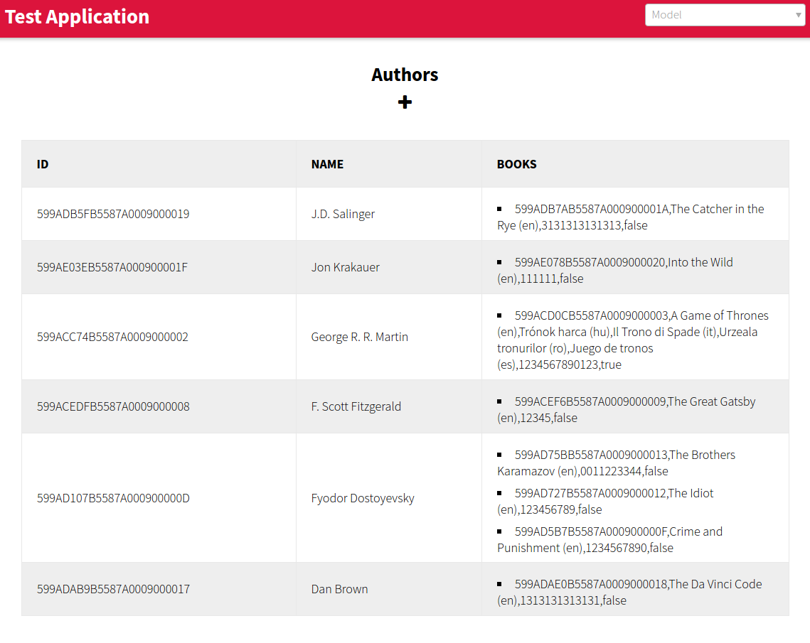

# Ember-mu-application-generator Application Usage

## Main Page
The main generated page of the application will use the crimson color on the navbar. The main page can contain a basic title and message, both are customizable through the mu-application-generator-welcome-page component.

The navigation bar contains the title of the application and a routing menu. Clicking on the title brings you back to the main page. Using the roouting menu, you can switch between the different resources. Resources that have an index route will be shown.

## Index Page

For each resource an index page is generated. It will give you a list of that resource in a table. Each column of a table is an attribute or relation for the resource type.

The + button above the table gives you an option to create a new resource for this type. On ready-only applications, this button doesn't appear.

For the relation, by default it shows a string representation of the related item, what is a string version of all the attributes. You can change it to show only selected attributes. If you want to show the uri, mu-cl-resources will have to send back the uri.
Booleans are shown as checkboxes.

The table is paginated, the default value is 20. You can change the size in the router for each resource. Pagination controls have fast forwarding to the first and the last page, an option for go to a specified page and option to go to the next or previous page. If an option is not available, the button will be disabled.

There is a small text indicating the which page are you on right now and how many pages are there. And under it tells you which resources are you seeing now out of the number of available resources.

